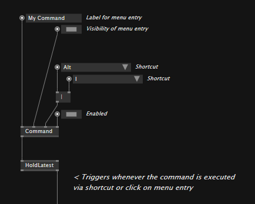

# Editor Extensions

Editor extensions allow you to extend the vvvv editor with your own tools. Examples of such extensions shipping with vvvv by default, are:

- The Key & Mouse display

Extensions can be entirely patched in vvvv and assigned a shortcut so they can be called by the user at anytime. You can find all currently loaded extensions in the main menu under:

    Quad > Extensions

## Creating an extension from the template

From the main menu choose:

    Quad > Extensions > New Extension...

and specify the destination and filename for your new extension .vl document in the file save dialog.

> NOTE
> The filename must end in `.HDE.vl` in order for the file to be a valid editor extension.

This copies the template to the given destination and opens the document for you, which should look like this:

Note the `Command` node here that allows you to register a command with the editor, by specifying:
- A label for the menu entry
- Whether the menu entry is visible
- A shortcut

Now check the output of the `Command` that will trigger whenever the command is executed via shortcut or click on menu entry.

You take it from here. A classic usecase will be showing/hiding an editor extensions window on repeated executions of the command. But you're free to run even `format c:` here, so handle with care...

## Multiple extensions per .HDE.vl file
If that is what you need, then yes, simply register multiple commands in your document. 

Note though, that should one of your extensions have a runtime error, all the others running in the same document, might be affected as well. 

## Packaging extensions in a nuget
In order for vvvv to pick up editor extensions from installed nugets, their nuget ID also has to end in `.HDE`, e.g.:

    VL.MyExtension.HDE

which in turn requires the .vl document inside that nuget to be following the same naming and be called:

    VL.MyExtension.HDE.vl

## Debugging Extensions
tbd