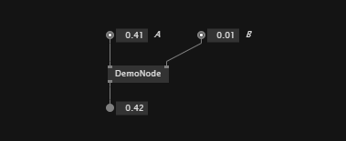
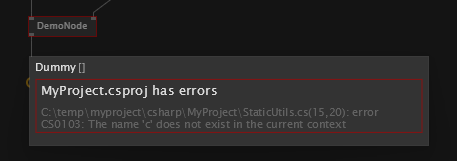
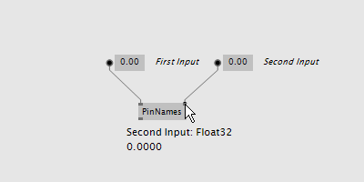
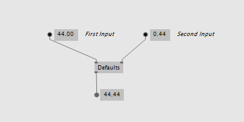
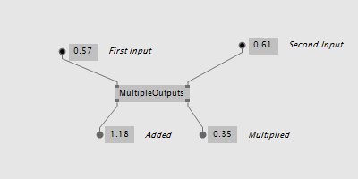
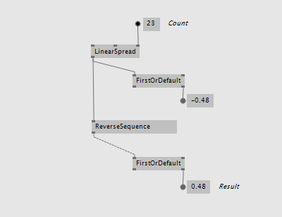
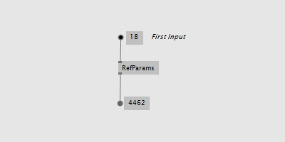
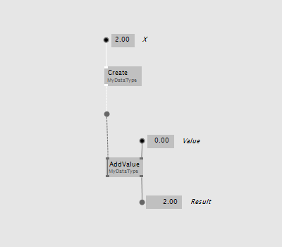
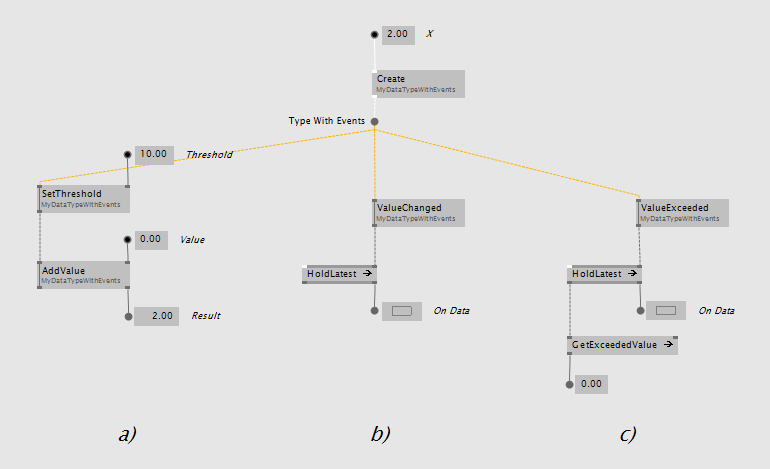

# Writing nodes using C#

Writing your own nodes for VL using C# requires no VL specific knowledge or preparation. Essentially you’re writing plain C# code that VL then turns into nodes. Here is a step by step guide to get you started:

## Start from a Template


Use the built-in C# Wizard (as of version 5.0)
- `Quad` -> `New` -> `C# File`
- Choose one of the templates
  - By default  a .csproj file with the name of your current main document will be created. If such a .csproj already exists, it will add the C# file to it. This is assuming the typical scenario will be one .csproj file with possibly many .cs files for your project
  - Optional: To override this default behavior, you can open the `Customize` dropdown:
      - Manually specify a name for the .cs file
    - Choose to which among possibly multiple .csproj files you want the file added to
    - Uncheck `Use Existing` to create a new .csproj file
- In the `Open on Create` pulldown you can choose:
  - Open the .csproj: Ideally you have an IDE like Visual Studio 2022 installed and open the .csproj file
  - Open the .cs file: If you don't have a full IDE installed, you can also simply edit the .cs files with any text editor
  - Open Folder: In case you don't want to edit the file at this point, you can also just see where it is located by having the explorer opened, pointing to it
- Press `Create`
  - This will create the file(s) on disk and reference the .csproj file to you current main document


<center>The Static Utils template opened in Visual Studio 2022</center>

The first time a new .csproj file is created, you will see it is automatically referenced to your active document, like so:


<center>A .csproj file referenced in a .vl document</center>

> NOTE
> Don't use referenced .csproj files when you're working on a library you're going to ship as a NuGet! It would force the whole package and all packages that depend on it editable, meaning you'd lose the benefit of a [read-only package](../language/compilation.md#read-only-packages). 

## Create the node
Open the [NodeBrowser](../../hde/the_nodebrowser.md) and find the methods and classes of your c# file by their names.

The Static Utils templates' code for example will then translate to the following node in VL:


<center>Resulting node in VL</center>

## Compilation and Hotswap
Everytime you make a change in a .cs file and save it, code compilation will be triggered and the running code immediately "hotswapped". 

### Static methods
This works flawlessly as long as you're only working with static menthods since those can be replaced on-the-fly without any side-effects. 

If there is an error in your C# code, all nodes stemming from the same project will turn red, with the tooltip indicating an error with the project, pointing you to the exact .cs file and line of the first error found.



### Classes
If you're dealing with stateful code, it gets a bit more tricky. Here are two typical scenarios:

#### Process node
Assuming you want to treat your C# class like a [process node](../language/nodes.md#process-nodes) in VL, ie one instance per node, not dynamically spawning/killing instances, then take your class and create a [Forward](forwarding.md#process-node) for it. 

This allows vvvv to properly create/dispose instances of your class as needed, whenever you make a change to your C# code.

#### Dynamic instances
If your C# class is going to be used more like a "Particle", ie you'll be dynamically spawning/killing instances, a Forward as mentioned above will not help you with dispose issues that you may run into. So here is what you have to know: 

Every time you save your .cs file, you will loose all running state of instances that are defined in C# code!

As long as your C# code is fully managed, this will not be too big an issue. You'll see pink nodes with Nullpointer exceptions ("Object reference not set an instance of an object") in your patches where those instances were and restarting the patch with F9 will get you back into a running state.

It gets more tricky as soon as your C# code depends on unmanaged code (e.g. WinForms, device libraries,...) which requires manual disposal of resources. vvvv does not know about those resources and can therefore not clean those up properly! In such cases you'll end up with unfreed resources whenever saving your .cs file which often leads to undefined behavior (eg. devices that cannot be accessed anymore). Only a complete restart of vvvv will help to get into a working state in such situations!

## Debugging
When editing your code with Visual Studio, you can set break-points in your C# code. Then [attach](https://learn.microsoft.com/en-us/visualstudio/debugger/attach-to-running-processes-with-the-visual-studio-debugger?view=vs-2022) to vvvv.exe and see the break-points hit. 

## Examples
Every static or member method of a public class you write in C# will turn into a VL node. 

Here are some simple examples and a few more details that will help you create your own nodes. Those are also available via:
 https://github.com/vvvv/VL.DemoLib

For more general considerations also see: [Design Guidelines](design_guidelines.md)

### Namespaces 
The Namespace you specify in C# will turn into the nodes category in VL. Nested namespaces (using dot syntax) will be translated to nested categories accordingly.

### Pin Names

For better readability in VL, an operation's arguments are separated at camelCasing. So "firstInput" in c# turns into "First Input" in VL. The default “return” value is called "Output" in VL.

```csharp
public static float PinNames(float firstInput, float secondInput)
{
    return firstInput + secondInput;
}
```


<center>Tooltip shows pin name</center>

### Default Values

Simply use the c# notation for defaults to define defaults for inputs in VL.

```csharp
public static float Defaults(float firstInput=44f, float secondInput=0.44f)
{
    return firstInput + secondInput;
}
```


<center>Default on Input</center>

### Multiple Outputs

Instead of returning a single value you can also use one or even multiple out parameters that will show up as output pins on the VL node:

```csharp
public static void MultipleOutputs(float firstInput, float secondInput, out float added, out float multiplied)
{
    added = firstInput + secondInput;
    multiplied = firstInput * secondInput;
}
```


<center>A node with multiple outputs</center>

### Function Overloading

You can write multiple operations with the same name that only differ in the number of input parameters:

```csharp
public static float MyAddition(float input, float input2)
{
    return input + input2;
}

public static float MyAddition(float input, float input2, float input3)
{
    return input + input2 + input3;
}
```

Choosing the respective node in the NodeBrowser will then ask you for a further choice to specify the which version you want to use.

*Image:NodeBrowser shows two nodes*

### Using Enums

You can use custom c# enums as input or output types to operations:
```csharp
public enum DemoEnum { Foo, Bar };

public static string StaticEnumDemo(DemoEnum e)
{
    return e.ToString();
}
```


<center>Enum IOBox in VL patch</center>

For an example of a dynamic enum (ie, one whose entries change during runtime), see below.

### Using Generics

VL embraces generics, so of course you can write generic nodes easily:

```csharp
public static string Generic<T>(T input)
{
    return input.ToString();
}
```


<center>Generic pin out of node</center>

### Operating on Spreads

The c# IEnumerable<> appears as Sequence<> in VL:

```csharp
public static IEnumerable<float> ReverseSequence(IEnumerable<float> input)
{
    return input.Reverse();
}
```


<center>Spread node</center>

### Documentation

Use XML documentation in C# to provide some information about your nodes:

* Summary: A one-liner info about the node
* Remarks: Some additional remarks, like usage instructions, warnings,.. can be multi-line
* Param name: Short info for each Input
* Returns: Short info about the result of the node

```csharp
///<summary>Multiplies input by two</summary>
///<remarks>Some additional remarks</remarks>
///<param name="a">The A Parameter</param>
///<returns>Returns 2 times a</returns>
public static int HTMLDocuTest(int a)
{
    return a*2;
}
```


<center>Documentation shows up in NodeBrowser and Tooltip</center>

> [!NOTE]
> Don't forget to enable "XML Documentation File" in the c# projects properties to make sure the .xml file holding the documentation is generated. This file will then always need to be next to the .dll, therfore always move those two files together!

### C# Ref Paramters

You can use C# _ref_ parameters, but beware: Assigning the parameter leads to undefined behavior in VL (for now), so never write to but only read from _ref_ parameters!

```csharp
public static int RefParams(ref int firstInput)
{
    return firstInput + 4444;
}
```


<center>A node with a _ref_ parameter as an Input</center>

### Datatypes

Any datatype that you define as class or strcut in c# can be used in VL:

* Any constructor will be available as a Create node
* Any get-property will show up as a node returning the properties value
* Any set-property will show up as a node called Set.. allowing you to set the properties value
* Any public static or member method will be available as a node in VL. Private or Protected operations will be ignored.

```csharp
public class MyDataType
{
    private float FX;

    public MyDataType(float x)
    {
        FX = x;
    }

    public float AddValue(float value)
    {
        var lastFX = FX;
        FX += value;

        return FX;
    }
}
```


<center>Corresponding nodes</center>

### Events/Observables

VL translates .net events that conform to the [.NET Core Event Pattern](https://docs.microsoft.com/en-us/dotnet/csharp/modern-events) to Observables automatically. So you can simply use events in your code and then access them in VL via the Observable pattern.

Here is an example of c# events without and with event arguments:

```csharp
public class MyDataType
{
    public event EventHandler OnValueChanged;
    public event EventHandler<MyGenericEventArgs<float>> OnValueExceeded;
    ...
}

public class MyGenericEventArgs<T> : EventArgs
{
    public readonly T Value;

    public MyGenericEventArgs(T value)
    {
        Value = value;
    }
}
```

In your code those could be called like this:

```csharp
public float AddValue(float value)
{
    if (value != 0)
    {
        FX += value;
        OnValueChanged?.Invoke(this, EventArgs.Empty);
    }

    if (FX > FThreshold)
        OnValueExceeded?.Invoke(this, new MyGenericEventArgs<float>(FX));

    return FX;
}
```
In VL those events are available as nodes of the same name that return an `Observable<EventPattern<>>`:


<center>How this looks in VL: a) Member Operations, b) ValueChanged event without any arguments, c) ValueExceeded event with an argument</center>

* In case your event does not have any arguments _(section 'b' on the image above)_, but simply sends a bang when something happens, use the `On Data` output of the HoldLatest [Reactive] node to be informed of the event.

* If your event does have arguments _(section 'c' on the image above)_ you'll receive an `Observable<EventPattern<MyGenericEventArgs<>>>` which you'll have to unpack using the EventArgs [Reactive.EventPattern] node, which is available via the VL.DevLib package. The node then gives you access to the Sender and Value of the EventArgs.


<center>Unpacking using EventArgs</center>

For general information on workig with Observables see the chapter about [Reactive Programming](reactive.md).

### Dynamic Enums

Dynamic enums are useful in cases where you want to offer users a list of items to choose from, where the entries of that list may change during runtime. A typical example are nodes that give access to hardware devices that can be plugged in and removed anytime.

Consider a normal enum in c#:
```csharp
enum MyEnum = { Foo, Bar }
```
Here `MyEnum` is what we call the type and `{ Foo, Bar }` makes its definition.

And the way we want to use such an enum in our code is to have it as the type of an input parameter to one of our operations,  like this:
```csharp
public static string EnumDemo(MyEnum e)
{
    return e.ToString();
}
```

#### Implementing dynamic Enums for VL

Now in order to create a dynamic enum for VL we also need those two elements, the type and the definition. Both need to be implemented as classes in c#:

* The type needs to implement `IDynamicEnum`
* The definition needs to implement `IDynamicEnumDefinition`

both of which come with the VL.Core nuget.

To make their use easier there are also baseclass implementations available:

* `VL.Lib.Collections.DynamicEnumBase<T, U>`
* `VL.Lib.Collections.DynamicEnumDefinitionBase<U>`
* `VL.Lib.Collections.ManualDynamicEnumDefinitionBase<U>`

Note that the definition base classes are Singleton, meaning that its implementation takes care that always only one instance exists of it globally. We want this because it is important that any node that is referring to a specific enum definition always gets exactly the same entries!

Using the above two baseclasses, an implementation of your own dynamic enum could look like this:

##### 1. Create an enum type

First derive from the `DynamicEnumBase` to create your own enum type.

```csharp
[Serializable]
public class MyEnum: DynamicEnumBase<MyEnum, MyEnumDefinition>
{
    public MyEnum(string value) : base(value)
    {
    }

    [CreateDefault]
    public static MyEnum CreateDefault()
    {
        //use method of base class if nothing special required
        return CreateDefaultBase();
    }
}
```

The code above most likely doesn't need many changes for your own implementation except:

* Give it a proper name instead of "MyEnum", something like e.g. "MidiInputDevice". Note the singular in the naming: This type represents one entry in the enumeration.
* Note the second type parameter `MyEnumDefinition` which connects your enum to its definition and should similarly be called "MidiInputDeviceDefinition"

##### 2. Provide available entries

Derive from `DynamicEnumDefinitionBase` to implement the class that provides the available entries of your enum to the system. Here you only have to override two functions: One that can return a list of current enum-entries as strings and another one that tells the system when your enum-entries have changed.

```csharp
public class MyEnumDefinition : DynamicEnumDefinitionBase<MyEnumDefinition>
{
    //return the current enum entries
    protected override IReadOnlyDictionary<string, object> GetEntries()
    {
    }

    //inform the system that the enum has changed
    protected override IObservable<object> GetEntriesChangedObservable()
    {
    }

    //optionally disable alphabetic sorting
    protected override bool AutoSortAlphabetically => false; //true is the default
}
```

Implementations here will vary depending on your usecase. A simple example could look like this:

```csharp
public class ComPortDefinition : DynamicEnumDefinitionBase<ComPortDefinition>
{
    protected override IObservable<object> GetEntriesChangedObservable()
    {
        return HardwareChangedEvents.HardwareChanged;
    }

    protected override IReadOnlyDictionary<string, object> GetEntries()
    {
        Dictionary<string, object> portNames = new Dictionary<string, object>();

        foreach(var portName in NetSerialPort.GetPortNames()
            .Where(n => n.StartsWith("com", StringComparison.InvariantCultureIgnoreCase)))
        {
            //the return dictionary holds the names of the entries as key with an optional "tag"
            //here the tag is null but you can provide any object that you want to associate with the entry
            portNames[portName] = null;
        }

        return portNames;
    }
}
```

For using dynamic enums in VL, see: [Enumerations](https://thegraybook.vvvv.org/reference/language/enumerations.html#dynamic-enums).