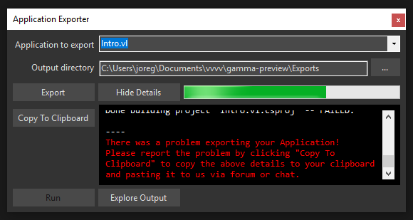

# Exporting Applications

vvvv allows you to export a patch into an executable, standalone program. In order to do so, open the Application Exporter via `Quad > Export...`.

The Application Exporter (Shortcut: F9)

* Application to export: Choose which application to export (in case you're working on multiple projects at the same time)
* Output directory: Choose where the exported program and files will be created
* Press the __Export__ button and wait until the green progressbar is full and the __Run__ button becomes available
* Press __Run__ to test/run your program
* __Explore Output__: opens a file explorer at the specified output directory

## Output Directory
After a successful export, the output directory will contain a directory with the name of your application. Inside this directory you find the executable. To run the program on another PC you need to copy the whole content of this directory.

### Source Directory
Next to the application directory you'll also find a `\src` directory. This is an artefact that vvvv creates during export and can be safely deleted.

> [!NOTE]
> .NET developers may find this interesting though, as it contains a completely valid c# solution of the exported project that can be opened, viewed and modified with Visual Studio.

## Options
### Console App
Choose between Windows or Console app. A Console app will open a windows Console and run the Update operation for only one frame, then immediately Dispose itself. So in order to keep it running you need to take care of blocking the operation yourself. You can do that for example by running your program in an endless loop... 

Useful nodes: 
- Args [System] to access commandline arguments the app was called with
- Nodes from the advanced [System.Console] category

Useful libraries:
- [Terminal.Gui](https://github.com/migueldeicaza/gui.cs) for creating  applications with a text based UI

### 64bit
Disable to export for 32bit architectures.

> [!NOTE]
> If a 32bit application that references VL.Stride fails to run even on your developer PC, make sure it has [Microsoft Visual C++ Redistributables 2013 and 2019](https://docs.microsoft.com/en-US/cpp/windows/latest-supported-vc-redist?view=msvc-160) for x86 installed.

### Clean Output
If active, removes artefacts of previous exports (ie. deletes the \src folder) before exporting. This will cause exports to take longer but also makes sure previous artefacts don't interfere with the new export.

## Assets

Using referenced external assets in exported executables for now is a bit cumbersome:

Instead of simply using *Path* IOBoxes to reference files, you have to manually concatenate every assets path by adding the result of __ApplicationPath [System.Application]__ with a string of the relative path to your asset. Then, if needed, use a __ToPath [IO]__ node to convert the resulting *string* into a *Path*.

Creating paths relative to the exported executable

Also after export you have to manually copy the assets to the output directory!

> [!NOTE]
> During development a path created like that will be relative to your main .vl document. When exported, it will be relative to the executable.

## Configuring a renderers appearance

Referencing the nuget VL.CoreLib.Windows adds the following nodes:

* SetWindowState and WindowState
* SetWindowMode

These allow you to configure the renderers caption, controlbox, framing and more.

## Code Signing
In order to have your executables to run without a warning on other PCs, you need to sign them with a certificate using [SignTool](https://docs.microsoft.com/en-us/windows/win32/seccrypto/signtool).

## Dependencies
If your application is referencing VL.Stride, make sure the target PC also has the following dependencies installed:
* [Microsoft Visual C++ Redistributables 2013 and 2019](https://docs.microsoft.com/en-US/cpp/windows/latest-supported-vc-redist?view=msvc-160) 
* [MSBuild Tools](https://visualstudio.microsoft.com/thank-you-downloading-visual-studio/?sku=BuildTools&rel=16)

## Troubleshooting

### Export fails
In case the export fails, the console will be opened to show there was an error.

The Application Exporter reporting a problem

Please send us the console output by pressing "Copy To Clipboard" and pasting it to us via forum or chat.

### Exported app doesn't run on target PC

Chances are that you're missing a dependency on the target PC. See 'Dependencies' above.