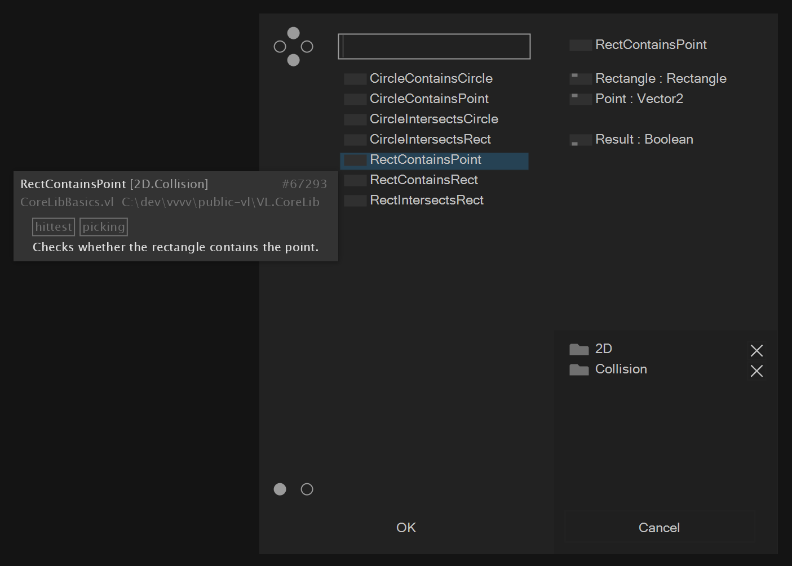
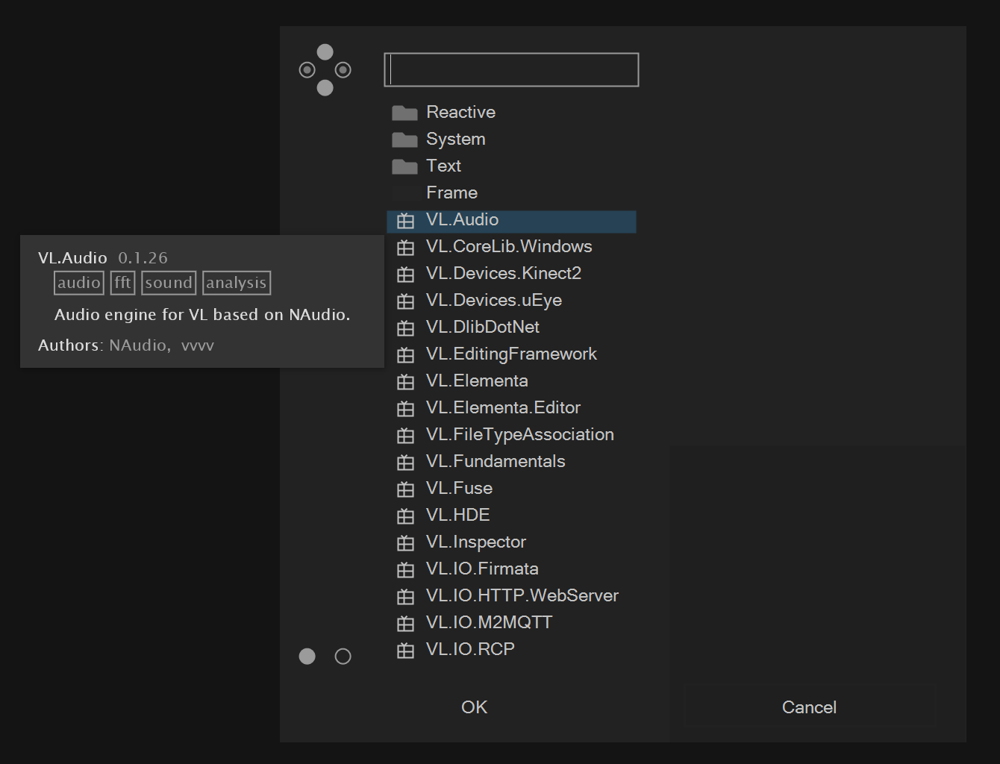

# The NodeBrowser

When opening the NodeBrowser via a left double-click anywhere on a patch what you see is:

* a list of top-level node categories
* language primitives (_written in italic_)
* a list of available nugets

The NodeBrowser

You can also bring up the NodeBrowser:

* while linking by double leftclicking to create a node that is connected to the link at hand
* by double leftclicking on an existing link to insert a node there
* by double leftclicking an existing node to replace it

## Available Nodes
There are different ways to navigate the list of available nodes:

* by categories
* by tags

In both cases it helps to be familiar with the icons:

 Category

 Type Category

 Process Node

 Operation Node

 Nuget

Hovering any entry that represents a node will show you the nodes Inputs and Outputs in the topright corner of the NodeBrowser and a tooltip will show you the description associated with the node if available.

When you're clicking an entry that represents a node two things may happen:

* if your selection is unambiguous the node will be created
* there are situations where a selection is ambiguous in which case the NodeBrowser prompts you to specify more details by choosing from the offered options.

### Search By Category
Nodes in VL are organized in a hierarchical structure of categories. Click any of the categories to enter it.

Selected Tags

Note that when entering a category a tag appears in the bottom right part of the NodeBrowser. The listing is now filtered by this tag. Choose another category from the listing to refine your search or remove a tag by clicking on the X button next to it. Pressing the ESC button always removes the last tag.

### Search By Tag
Enter any word to search for it.

## Language Primitives
The language primitives are written in _italic_:

* IOBox
* Pad
* Pins (Input, Output)
* Patch Definition
* Canvas
* Record Definition
* Class Definition
* Operation Definition
* Delegate
* Regions (Repeat, Foreach, If)

Many of the primitives can be given a name directly after choosing to create them via the NodeBrowser. For Pins and Pads it also works the other way round: type a name into the NodeBrowser and then click Pin/Pad to create the respective element with already the desired name set.

## Available Nugets
Nugets that are available for VL but not referenced by the active document show up in the NodeBrowser from where you can quickly reference them via a single click. After the nuget is referenced all its nodes show up in the NodeBrowser.

Nugets in the NodeBrowser

If you want to get rid of a nuget again you have to uncheck it in the documents list of dependencies.
