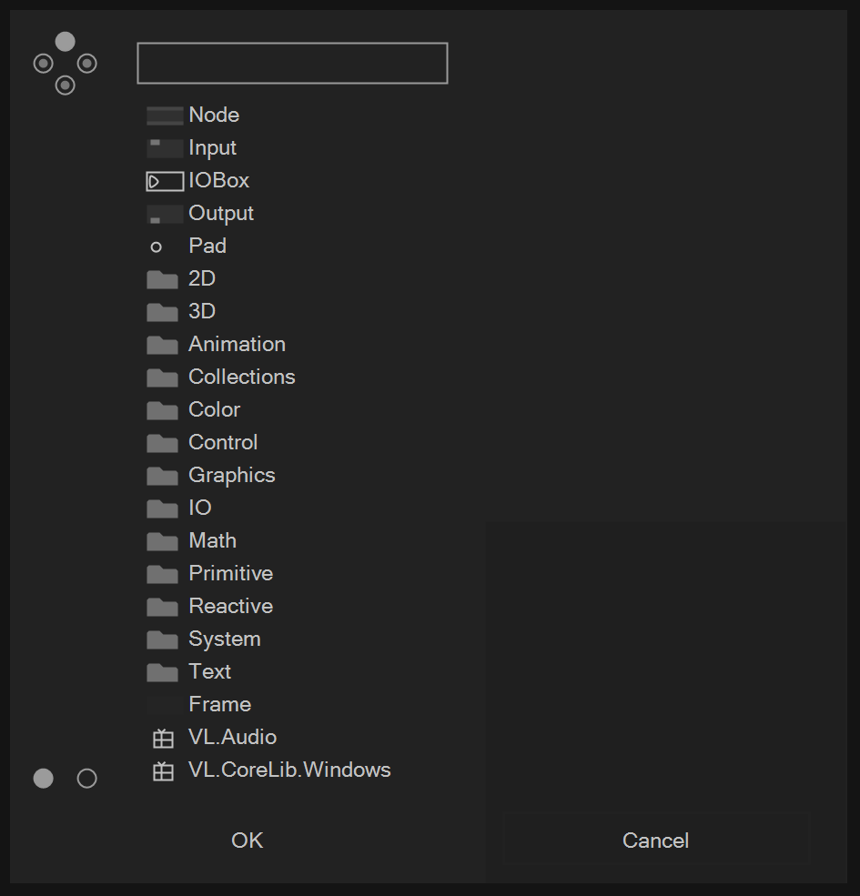

# The NodeBrowser

When opening the NodeBrowser via a left double-click anywhere on a patch what you see is:

* Language primitives (Node, Input, IOBox,...)
* A list of top-level node categories (2D, 3D, Animation,...)
* A list of available nugets (VL)

You can also bring up the NodeBrowser:

* While linking by double leftclicking to create a node that is connected to the link at hand
* By double leftclicking on an existing link to insert a node there
* By double leftclicking an existing node to replace it

## Filtering nodes

The circles on the left side are filters that let you quickly include or exclude a certain group of nodes. Hover them with the mouse to see their purpose and click to toggle them on or off:
- Include high level nodes (the standard set)
- Include potential future nodes (Experimental)
- Include low level nodes (Advanced)
- Include obsolete, old nodes (Obsolete)

The bottom two circles are two more filters:
- Include internal nodes (those that are only visible inside this document)
- Include external nodes (from referenced .dlls and NuGets)

If you see a dot inside of a circle, it means that, given the current search term you would get additional nodes listed, if this filter was on.

## Finding Nodes
There are different ways to navigate the list of available nodes:

* By category
* By tag

In both cases it helps to be familiar with the icons:

 Category

 NuGet Package

Nodes:

 Process Node

 Operation Node

Types:

 Record

 Class

 Enumeration

 Interface

Hovering any entry that represents a node will show you the nodes Inputs and Outputs in the topright corner of the NodeBrowser and a tooltip will show you the description associated with the node if available.

When you're clicking an entry that represents a node two things may happen:

* If your selection is unambiguous the node will be created
* There are situations where a selection is ambiguous in which case the NodeBrowser prompts you to specify more details by choosing from the offered options.

### Search By Category
Nodes in VL are organized in a hierarchical structure of categories. Click any of the categories to enter it.

Note that when entering a category, a tag appears in the bottom right part of the NodeBrowser. The listing is now filtered by this tag. Choose another category from the listing to refine your search or remove a tag by clicking on the X button next to it. Pressing the ESC button always removes the last tag.

### Search By Tag
Enter any word to search for it.

## Language Primitives
The language primitives are written in _italic_:

* IOBox
* Pad
* Pins (Input, Output)
* Patch Definition
* Canvas
* Record Definition
* Class Definition
* Operation Definition
* Delegate
* Regions (Repeat, Foreach, If)

Many of the primitives can be given a name directly after choosing to create them via the NodeBrowser. For Pins and Pads it also works the other way round: type a name into the NodeBrowser and then click Pin/Pad to create the respective element with already the desired name set.

## Available Nugets
Nugets that are available for VL but not referenced by the active document show up in the NodeBrowser from where you can quickly reference them via a single click. After the nuget is referenced all its nodes show up in the NodeBrowser.

If you want to get rid of a nuget again you have to uncheck it in the documents list of dependencies.
