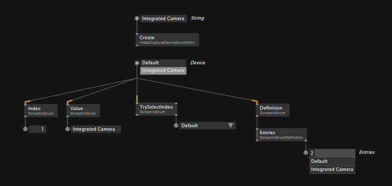

# Enumerations

An enumeration type (or enum type) is a value type defined by a set of named constants. VL has two different types of enumerations: 
- Static Enums
- Dynamic Enums

> [!NOTE]
> As of now, enums can only be used but not created in VL. For defining a new enum, for now you'd have to resort back to writing C# and loading a compiled .dll that includes the enum type.

## Static Enums
Entries of a static enum are fixed and cannot change at runtime. An example would be the type `LinearSpreadAlignment`.

For working with static enums, use nodes from the `Primitive.Enum` category. 

## Dynamic Enums
A dynamic enum can have entries added, removed or changed during runtime. They are used for example for device enumerations. 

For working with dynamic enums, use nodes from the (advanced) `Primitive.DynamicEnum` and `Primitive.DynamicEnumDefinition` category.

For defining custom dynamic enums in C# see: [Defining Dynamic Enums](../extending/writing-nodes.md#dynamic-enums).
