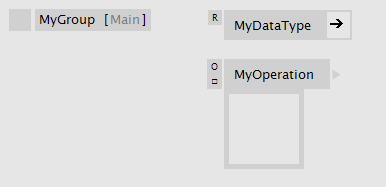
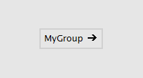
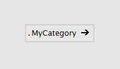
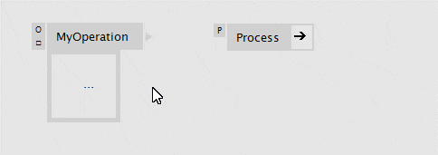

VL has 3 patch types that help you structure your documents:

* Group
* Category
* FullCategory

## Group
Group patches simply allow you to create more space in a document by opening a new canvas. The groups name is merely used for human readability, vl doesn't care about it at all. Create a group by typing "group" in the NodeBrowser. Groups can be nested.

Inside a group patch

Group patch from the outside

## Category
A Category patch looks quite similar to the group, only its name has a meaning: The name appends itself to the category of its parent patch. That way you can build up any category hierarchy, that you then see in the NodeBrowser. Multiple category levels are allowed with dot notation. e.g. _MyCat1.MyCat2_ etc.

Inside a category patch

Category patch from the outside

## Full Category
A Full Category patch is similar to the Category patch, only that it doesn't add its category to the parent. By that you can place nodes in any category, regardless of the parent patch. It's considered bad practice to do that, but is useful to add nodes to an existing category like Collections.Spread, for example. Multiple category levels are allowed with dot notation. e.g. _MyParentCat.MySubCat_ etc.

Inside a category patch

Category patch from the outside

Each vl document can directly start a category, which you can define in the angular brackets in the top left corner of the document patch.

"Voo" specified as a documents category

## Changing the Patch Type
You can easily convert a group patch into a category patch and vice versa by the patch type enum. Note how the label changes and represents the actual category structure:

Converting a group into a category

## Setting Categories on Definitions
As if the above didn't offer enough options already there is one more way to specify a category for an operation or a datatype definition:

Setting a Category on an datatype or operation definition

