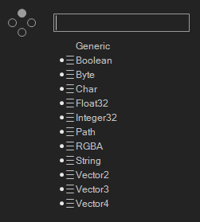
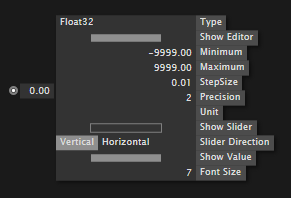
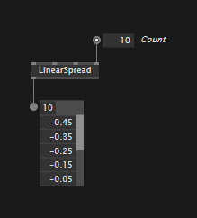

# IOBoxes

Short for "Input/Output boxes", they allow you to _input_ constant data into your program or _output_ it for debugging or display purposes.

Some IOBoxes of different types

You typically create an IOBox by starting a link from an input or output pin and then using a Middleclick (or <kbd>ALT</kbd> + leftclick) to create the according IOBox. Alternatively you can create an IOBox by selecting one from the nodebrowser popping up when you right doubleclick in the patch.

Choose an IOBox from the nodebrowser after double rightclick

An IOBox exists for each primitive datatype and they all have some special features which you can learn about here:

## Configuring IOBoxes
Configuring IOBoxes via their inspector works the same for all of them:

* Middleclick the IOBox
* or Rightclick its label and select `Configure`.

Configuring a number IOBox

## Numbers

Number IOBoxes work the same for whole (integer32, byte, ...) and real (float32, ...) numbers:

* Doubleclick to enter a value via keyboard

> [!NOTE]
> You can also enter math formulas like, e.g.: "1/3" that will be immediately be evaluated and fill the IOBox with the result

* Right-drag up and down to change the value gradually
** hold <kbd>SHIFT</kbd> while dragging, to divide the step-size by 10
** hold <kbd>CTRL</kbd> while dragging, to divide the step-size by (another) 10
** hold <kbd>ALT</kbd> in combination with the above to multiply instead of divide the stepsize
* <kbd>ALT</kbd> + Rightclick to reset the value to its default

Via the inspector you can configure the IOBox:

* Choose minimum and maximum and stepsize that will be taken into account when right-draging the value
* Choose a display precision
* Choose to display a unit for the value. The unit has no effect on the value and is only good for display purposes
* Choose to show a horizontal or vertical slider

## Vectors
For Vector IOBoxes you can foremost configure whether you want to view their individual components in a vertical or horizontal stack.

A 2d vector IOBox with the all-components editor visible

Also you can change all components at once by changing the value popping up above the IOBox when hovering it.

## Booleans
A boolean IOBox has three different button modes:

The three modes of a boolean IOBox

* Toggle: a rightclick toggles between TRUE and FALSE
* Bang: a rightclick makes it return TRUE for one frame, otherwise returns FALSE
* Press: returns TRUE as long as it is right-pressed, otherwise false

## Strings

Changing values in string IOBoxes works as follows:

* Doubleclick to enter text via the keyboard
  * While entering text press <kbd>CTRL</kbd><kbd>ENTER</kbd> to add a new line
* <kbd>CTRL</kbd> + Rightclick to open the file chooser dialog
* <kbd>SHIFT</kbd> + Rightclick to open the directory chooser dialog

Via the inspector you can configure the IOBox:

* Choose one of three string types:
  * *String*: the default
  * *Comment*: to put a comment in a patch
  * *Link*: to put a link as comment in a patch that open in the browser on rightclick
* Choose to visualize non-printable characters (ie. those with an ascii code < 32)

The three different types of string IOBoxes

## Colors
Color IOBoxes let you enter colors in many different ways:

* Doubleclick to enter the [name of a color](https://docs.microsoft.com/en-us/dotnet/api/system.windows.media.colors?view=netframework-4.8) via the keyboard
* Doubleclick to enter the values of a color in different formats:
  * a string of type: "H:0.00 S:0.00 V:1.00 A:1.00" where each component (hue, saturation, value and alpha of the HSVA color model) is a value between 0 and 1
  * a string of type: "R:0 G:255 B:0 A:255" where each component (red, green, blue and alpha of the RGBA color model) is a value between 0 and 255
  * a string of type: "RRGGBBAA" where each of RR, GG, BB and AA are pairs of hexadecimal values from 0 to 255, eg for red specify: "FF0000FF"

Change colors via mouse interaction:

Description | Action
-|-
Change brightness|Rightdrag up/down
Change hue|Rightdrag left/right
Change saturation|<kbd>Ctrl</kbd> + Rightdrag up/down
Change the alpha channel|<kbd>Shift</kbd> + Rightdrag up/down

## Paths

Path IOBoxes can be used to enter filenames or directories. By default they always assume you want to choose a filename!

* Rightclick to open open the file chooser dialog
* <kbd>SHIFT</kbd> + Rightclick to open the directory chooser dialog
* Click the [O] icon to open the currently selected file with its associated application
* <kbd>ALT</kbd> + click the [O] icon to view the file/directory in windows explorer

Via the inspector you can configure the IOBox:

* Choose between *File* or *Directory* as path type which simply determines which dialog a rightclick on the IOBox will pop up

## Collections
Collection IOBoxes work with all the above datatypes. If you want to manually create a collection IOBox, first create a normal IOBox of the type and then configure its type to be of eg. __Spread<Float32>__.

The number specifies the number of elements in the collection and can be changed. By default a collection IOBox will display up to 5 elements. When the collection contains more items, a scrollbar will be shown.

A spread of floats inspected via a collection IOBox

Via the inspector you can configure the IOBox:

* The number of maximum visible entries
* Show/Hide the entry index
* Define whether the entries will be displayed as a vertical or horizontal stack
* Add/Remove entries
