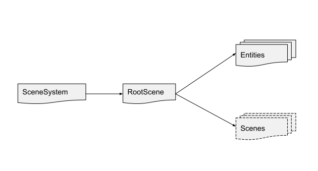

# Rendering
VL.Stride offers two workflows for rendering:
* **High-level**: Work with models, lights, materials, textures (Entity-Component-System)
* **Low-level**: Work with shaders, geometry, and GPU resources directly

If you worked with a game engine before, then you've used the high-level approach. If you're coming from vvvv beta and you worked with DX9/DX11, then you've been using the low-level approach.

Both workflows can be combined without any drawbacks, and both can render into a texture or an output window.

## High-level (scene graph)
Commonly known as entity-component-system (ECS). The scene graph consists of a tree of scenes that have entities.

<i>Scene graph data structure</i>

 

Each entity has a list of components that define the behavior and functionality of the entity. An entity can also have a list of child entities.

<i>Entity data structure</i>

 

Every entity has a `TransformComponent`. Child entities will multiply their transformation with the parent transformation.

To build the scene graph you can use the `Group` or `Group (Spectral)` nodes in the category `[Stride]`. A group node is technically just an entity that sets the input entities as its child entities.

### Root nodes
`SceneWindow` and `SceneTexture` both set up the scene system. Connect a `RootScene` to either of them and start building the scene graph from there.

See the help patches: `Overview Scene Graph Basics`, `Overview Scene Graph Advanced`, and `Work with Children`.

### Camera
The `SceneWindow` node comes with a built-in default camera that can be used with the mouse to look around in the scene. The default camera can be overwritten by connecting a camera to the _Camera_ input pin.

To build your own camera, you can use the Entity node and connect a `CameraComponent` to it, or use the `Camera` node that combines these two. The help browser has a section for cameras with several help patches.

### Models
See [Models and Meshes](models.md).

### Lights
A light component can be attached to any entity and it will use the transformation of the entity as the light transformation. The help browser has a dedicated section for lights with many help patches.

See also: [Stride Lights and Shadows doc](https://doc.stride3d.net/latest/en/manual/graphics/lights-and-shadows/index.html)

## Post Effects
The Stride render pipeline has a set of post-processing effects that can be applied to the rendered 3d scene. Such as ambient occlusion, bloom, and other screen space or image base effects.

The help browser has a `PostFX` section with many help patches.

See also: [Stride Post Effects doc](https://doc.stride3d.net/latest/en/manual/graphics/post-effects/index.html)

## Low-level (custom rendering)
This workflow allows you to manage your own draw calls with the graphics API. It takes more effort to use because you need to know about shaders, buffers, pipeline states, and other graphics API features.

The main data type is `IRenderer`. This interface can be implemented to take part in the rendering by connecting it to a render sink. The `MeshRenderer` or `QuadRenderer`, for example, are implementations of this interface.

You can order draw calls with the `Group` and `Group (Spectral)` nodes in the category `[Stride.Rendering]`. These group nodes are implementations of `IRenderer` that pass the draw call to the renderers connected to the input.

### Renderer sinks
There are several sinks to which you can connect an `IRenderer`. Depending on the use case and the moment in which you want to render.

#### `RenderEntity`
To participate in the scene rendering, this node can be placed in the scene graph and will pass on the draw call of the `SceneWindow` or `SceneTexture` to the connected `IRenderer`. It also has a setting to specify the render stage of the scene:
* `BeforeScene`: non-graphical, useful to prepare buffers or textures for the scene
* `Opaque`: the normal 3d render stage
* `Transparent`: the transparent stage, after Opaque
* `AfterScene`: after the scene, this can be used to draw into the final render target
* `ShadowCaster*`: these stages can be used to render into the shadow maps

#### `RenderTexture`
Render something into a texture with a specified size and format. Useful for rendering helper textures, such as masks, text, or other basic graphics that will be used in the scene.

#### `RenderWindow`
Render something into a window directly, without the high-level scene setup. Useful to display a fullscreen texture or to compose the final output of an application.

#### `RendererScheduler`
A very low-level node that schedules a draw call without a sink. It is used, for example, by the [TextureFX](texturefx.md) nodes to render into a texture.

If there is more than one `RendererScheduler`, then the order in which they are called in the update loop, is the order in which they will be called during the rendering.

For more details, see also: [Stride Low-Level API doc](https://doc.stride3d.net/latest/en/manual/graphics/low-level-api/index.html) and [Programming guide for Direct3D 11](https://docs.microsoft.com/en-us/windows/win32/direct3d11/dx-graphics-overviews)
