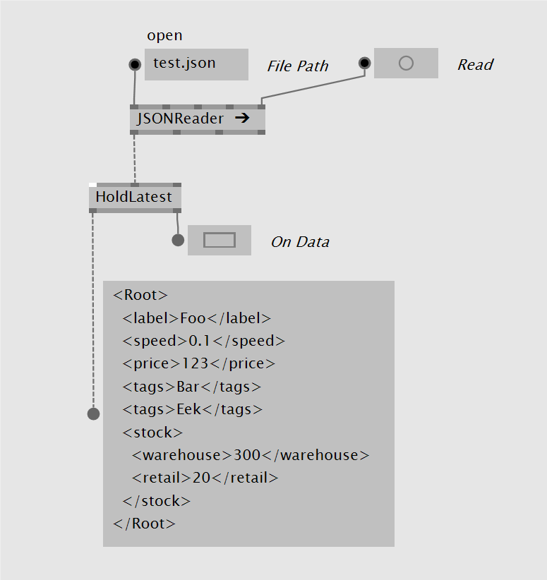
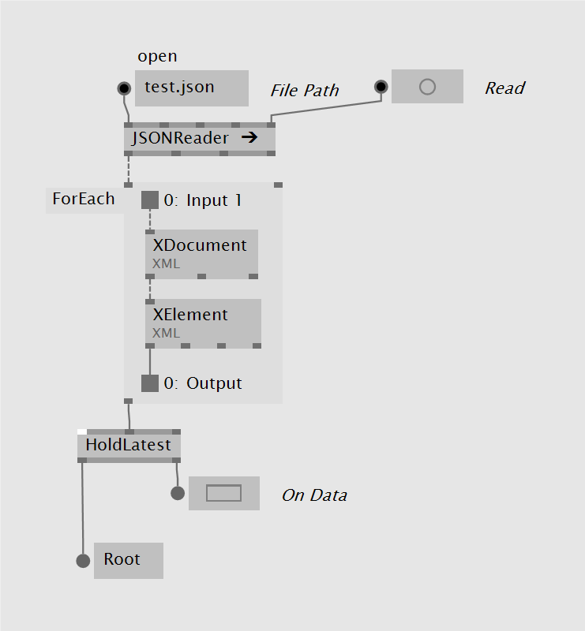
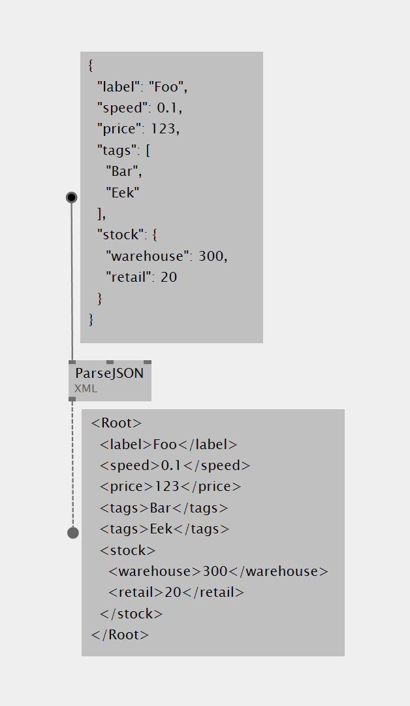
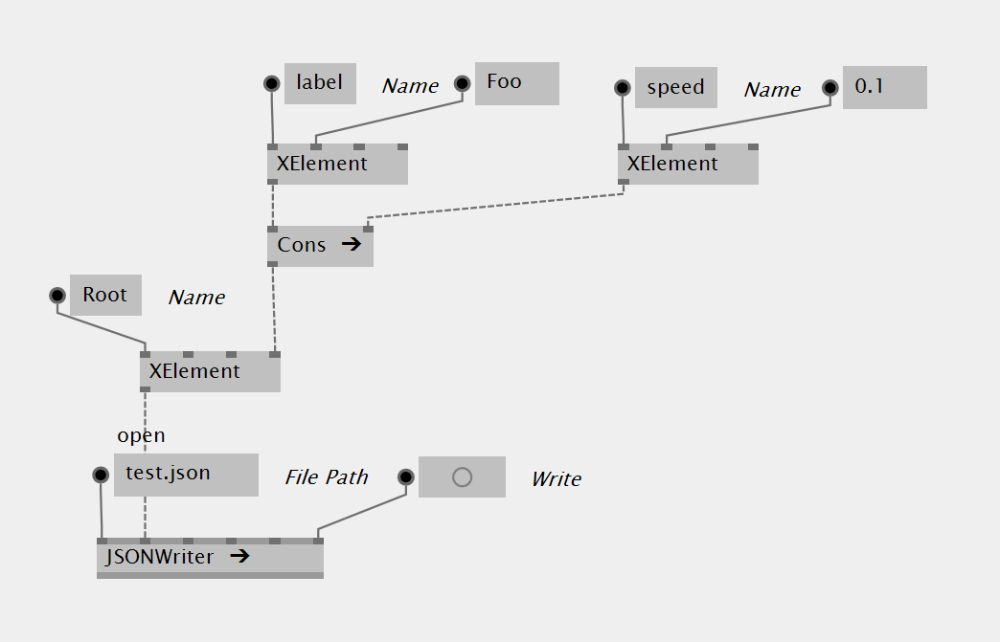
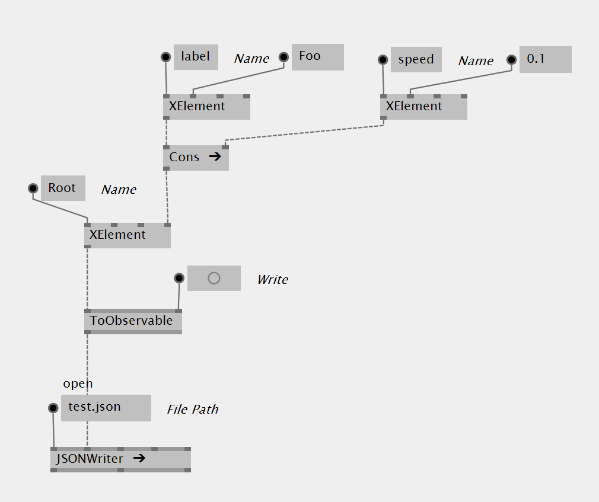
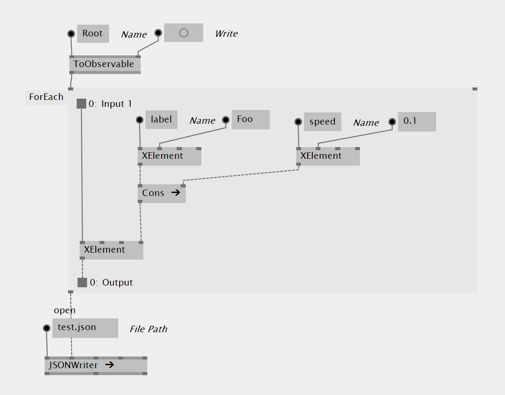
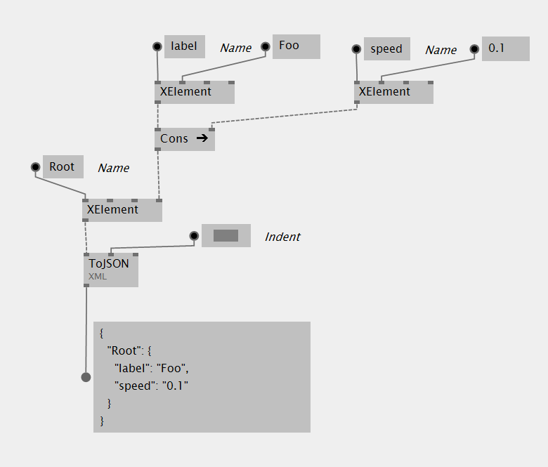

# JSON

Instead of operating on a JSON object directly, in VL by default the JSON is converted to an XElement which can be easily inspected and modified. Vice versa, an XElement can always be converted to JSON.

> [!NOTE]
> If in an advanced use case you find yourself in a situation where this conversion from JSON to XElement is not feasible, you can still operate on JSON directly by referencing a library like [JSON.NET](https://www.newtonsoft.com/json), as described in [Using .NET Libraries](using-net-libraries.md).

## Loading a JSON file

Loading a file is potentially a time-consuming process and thus can interrupt your otherwise smooth framerate. VL therefore provides two options for file readers:

* a simple to use, but blocking option
* a non-blocking option that requires a few more clicks to set it up

### Blocking
Use the *JSONReader [System.XML]* node to read a .json file and get the result in the form of an XElement:

The JSONReader loads a .json file and returns it as XElement instantly, potentially blocking the execution of the rest of the program

### Non-Blocking (Reactive)
The simplest way to load a .json file asynchronously is to use the *JSONReader (Reactive) [System.XML]* in connection with a *HoldLatest [Reactive]*. Once the file is loaded, the HoldLatest will bang its __On Data__ output and return the files content as an XElement:

The JSONReader (Reactive) loads a .json file and returns it as XElement in a later frame, so that the rest of the program is not interrupted

But while you're in the reactive/asynchronous world, you can also do some further parsing to the file, by e.g. using the *ForEach [Reactive]*:

In addition to loading the file asynchronously, in this example the name of the root element is being extracted as a simple example. But obviously here you can do more expensive operations that would still not interrupt your framerate

Like this loading and parsing is done asynchronously and only when both is done, you get access to the result for further processing.

## Parsing a JSON string

If you have a string in JSON format then simply use the *ParseJSON [System.XML]* node to convert it into an XElement for further processing:

## Saving a JSON file

Saving a file is a potentially time-consuming process and thus can interrupt your otherwise smooth framerate. VL therefore provides two options for file writers:

* a simple to use, but blocking option
* a non-blocking option that requires a few more clicks to set it up

### Blocking
Use the *JSONWriter [System.XML]* node to write a given XElement into a .json file:

### Non-Blocking (Reactive)
The simplest way to save a .json file asynchronously is to use the *JSONWriter (Reactive) [System.XML]* in connection with a *ToObservable [Reactive]*. Connect the XElement to the __Message__ input of the ToObservable node and bang its  __Send__ input to start the operation. Once saving is done, the __On Completed__ output of the JSONWriter will bang:

But even creating the XElement structure could already be time-consuming so you could also off-load that part of your patch to the reactive world and do it only just before writing the file by e.g. using the *ForEach [Reactive]*:

Like this creating the XElement and saving the file is done asynchronously and does not interrupt your framerate.

## Converting an XElement to a string in JSON format

If you have an XElement that you want to simply convert to a string in JSON format, use the *ToJSON [System.XML]* node:

