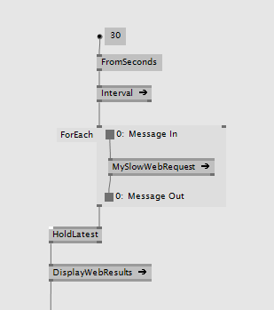
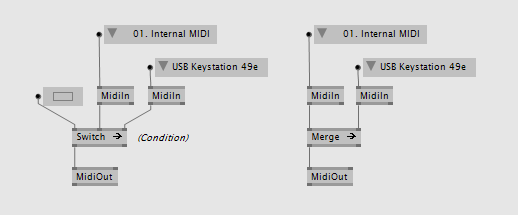
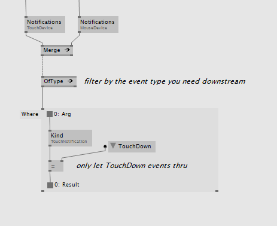

# Reactive

The Reactive category gives you tools to handle asynchronous events, background calculations and even enables you to build your own mainloop that runs on a different CPU core.

## Processing Events
The go to node for handling events is the _ForEach Region_ in the category _Reactive_. This region allows you to place any node inside and can also remember any data between two events. There is also one with version _Keep_ that can filter out events using a boolean output. This region is very similar to the ForEach region for spreads, only that its input and output is event values in time instead of slices of a spread.

Refresh web data every 30 seconds in the background and pass the result on to the mainloop

### Switching or merging event sources

Switching or merging midi events

### Filtering

There are also filtering options with _OfType_ or _Where_:

Only get TouchDown events from a combined event stream

Other nodes include

* Skip,
* Delay,
* Delay (Selector),
* Scan,
* Switch, ...

## Receiving Events

If you want to leave the observable world and pass event values to the mainloop use one of the 3 nodes

* HoldLatest: Returns always the latest value
* Sampler: Returns all event values since the last frame, can be empty
* S+H: Same as _Sampler_ but returns the same values until the next event occurs

which all behave a little bit different. Depends on what you need:

Three ways to get event values to the mainloop

## Creating Events
It's also easy to generate event sources of your own:

Different ways to create observable event sources

> [!NOTE]
> Only send values of type Record as event data because they are thread safe. If you send values of any Class type be sure that you know exactly what you are doing!
