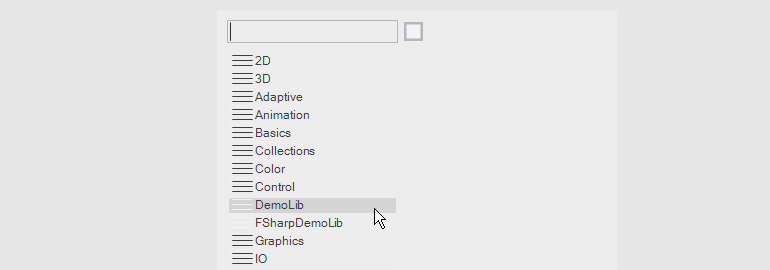

# Using .NET Libraries

Any static operation or member of a class defined in a .NET .dll (library) can be used as a node in VL.

## Referencing Libraries
To get access to the content of a library in a patch you only need to [reference](referencing.md) it as a dependency in the .vl document.

## Accessing nodes

Each referenced .dll shows up as a top-level category in the NodeBrowser. Enter it to explore the libraries' namespaces, types and operations. Hover the individual operations to read their associated xml-documentation. Click any operation to use it as a node in the patch.

NodeBrowser with the namespace 'DemoLib' from the VL.DemoLib.dll showing up as a toplevel category

Like this you can use practically any thirdparty .NET library and start patching with it immediately.

### Hiding dependencies from the Nodebrowser
At times it may be overwhelming to see all nodes from all dependencies in the nodebrowser. Use the toggle next to the edit-field to include or hide nodes from all dependencies in the nodebrowser.

Toggle to show/hide nodes of dependencies

## For your Consideration
Having access to just about any .NET library directly in VL is indeed quite convenient and powerful. With many simple libraries you'll have instant success. But obviously most libraries you'll find in the wild are not designed to be used in a dataflow context like VL. Patching with those is still possible but will require a better understanding of things than we'd normally want to ask from our users. Therefore we consider this feature of _"using .NET libraries directly"_ to be for the more advanced audience.

Below is a list of typical issues you'll encounter with third-party libraries which are often reasons for wrapping them into a more VL friendly form. See [Forwarding .NET Libraries](forwarding.md) for a few features we built into VL to make it easy to create such wrappers.

### Incompatible types
Libraries often use their own types for Vectors, Matrices,.. which will not be compatible directly with the corresponding VL types. You'll need to find a way to convert between those. Sometimes it may only be value ranges, like: angles or color components in VL go from 0..1 while other libraries often use different ranges.

Wrappers can hide those conversions from the user.

### Mutability
In a dataflow context it is most usable to deal with immutable datatypes. However most types from .NET libraries are mutable.

### Events
Many .NET libraries expose events that do not conform to the [.NET Core Event Pattern](https://docs.microsoft.com/en-us/dotnet/csharp/modern-events), which means that they cannot be automatically translated to Observables in VL. For those cases you'll have to write a wrapper in C# that converts the event to an observable manually, see [Observable.FromEvent](https://msdn.microsoft.com/en-us/library/system.reactive.linq.observable.fromevent(v=vs.103).aspx).

### Error Handling
There are different ways libraries can deal with errors but typically as users we want to have one consistent way.

Building a wrapper around a library allows us to adopt the VL way of handling errors and expose that to the end-user.

### Too Low-level
Third-party libraries are often rather low-level in the functionality they provide. In a visual language like VL we prefer to use more high-level nodes that already combine some features of a library to reusable building blocks.

Wrappers can be useful to combine often used low-level functionality into convenient high-level nodes.
