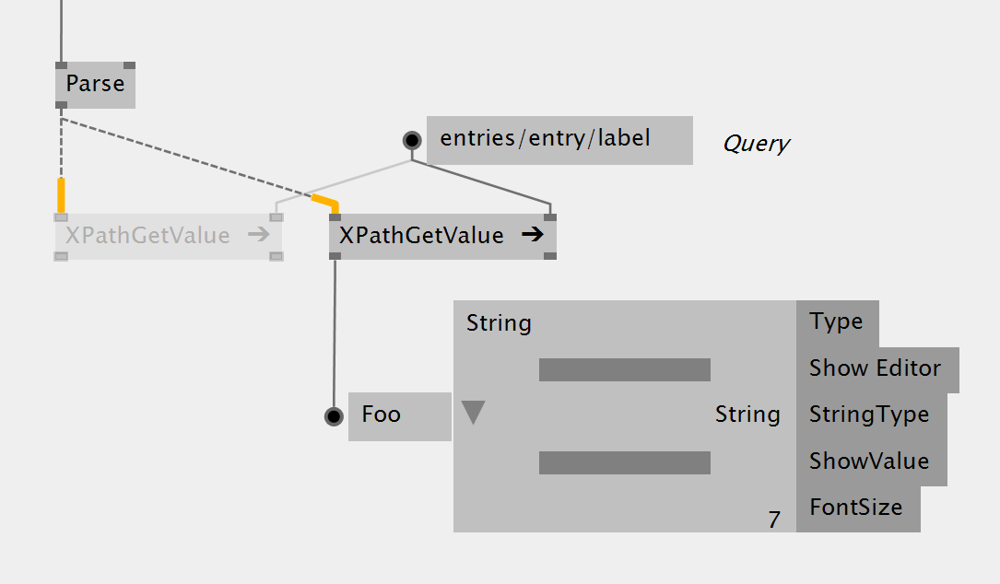

# XML

The datatype for handling XML data in VL is called *XElement*.

In the nodebrowser explore the category *System.XML* to get an overview of all the nodes available for operating on XElements.

The examples on this page refer to the following XML structure:

```xml
<?xml version="1.0" encoding="UTF-8"?>
<entries>
  <entry visible="true" >
    <id>1</id>
    <label>Foo</label>
    <description>A Thing</description>
    <speed>2.4</speed>
  </entry>
  <entry visible="false">
    <id>2</id>
    <label>Bar</label>
    <description>Another Thing</description>
    <speed>4.2</speed>
  </entry>
</entries>
```

## Extracting data from an XElement using XPath queries

General information about XPath can be found at W3CSchools: [XML and XPath](https://www.w3schools.com/xml/xml_xpath.asp)

Each XElement can have:

* a value
* a list of XAttributes
* a list of child XElements

Referring to the example above:

* the value of the first "label" element is "Foo"
* the element "entry" has one attribute with the name "visible". the value of the first entry's "visible" attribute is "true"
* the child elements of the "entry" element are: "id", "label", "description" and "speed"

### Accessing an element's value

To access the value of only the first occurrence of an element, use the *XPathGetValue [System.XML]* node:


<center>The first XPathGetValue node is grayed out (ie. not in use), because it does not yet have anything connected to its output. The second node has an IOBox connected that is configured to type 'String' which tells the XPathGetValue node to interpret the XElements value as a string</center>

To get the values of all occurrences of an element, use the *XPathGetValues [System.XML]* node:


<center>XPathGetValues returns the values of all queried elements as spread of whatever type is connected</center>

### Accessing an element's attributes

To access an attribute of only the first occurrence of an element, use the  *XPathGetAttributeValue [System.XML]* node:


<center>The first XPathGetAttributeValue node is grayed out (ie. not in use), because it does not yet have anything connected to its output. The second node has an IOBox connected that is configured to type 'Boolean' which tells the XPathGetAttributeValue node to interpret the XElements value as a boolean</center>

To get the attributes of all occurrences of an element, use the *XPathGetAttributeValues [System.XML]* node:


<center>XPathGetAttributeValues returns the values of all queried attributes as spread of whatever type is connected</center>
